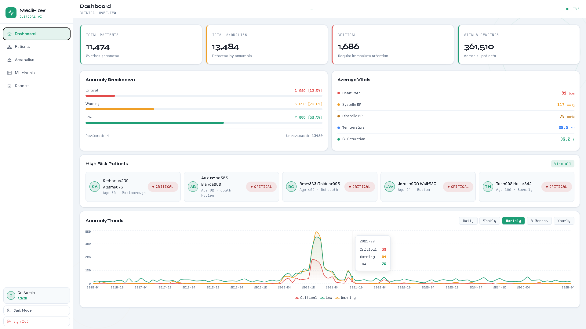

# MediFlow

[](https://python.org)
[](https://flask.palletsprojects.com)
[](https://react.dev)
[](https://microsoft.com/sql-server)
[](https://scikit-learn.org)
[](https://anthropic.com)
[](tests/)

Clinical data pipeline with ensemble anomaly detection and AI-powered insights. Ingests synthetic patient data, detects vital sign anomalies using three unsupervised ML models with majority voting, and surfaces Claude AI explanations through a secure REST API and React dashboard.

> **Demo:** [Watch on YouTube](#)



---

## Stack

| Layer | Technology |
|---|---|
| Data Generation | Synthea (Java) |
| ETL | Python, pandas, pyodbc |
| Database | SQL Server |
| Anomaly Detection | scikit-learn — Isolation Forest, LOF, One-Class SVM |
| AI Explanations | Claude API (claude-sonnet-4) |
| Backend | Flask 3.0, JWT, bcrypt |
| Reports | ReportLab (PDF), csv |
| Frontend | React 18, Recharts, Vite |

---

## Features

- **ETL Pipeline** — chunked ingestion of 11,474 patients and 361,510 vital sign readings from Synthea CSVs into SQL Server
- **Ensemble ML** — three unsupervised models with 2/3 majority voting detect 13,484 anomalies at a 3.73% anomaly rate
- **AI Explanations** — Claude API generates per-anomaly clinical explanations and full patient health summaries, cached in SQL Server
- **REST API** — 15+ JWT-protected endpoints with role-based access control (admin / doctor / nurse)
- **Model Retraining** — admin endpoint to retrain all three models on live data with a real-time progress overlay
- **Reports** — preview and download anomaly/patient CSV exports and a branded PDF clinical report
- **Dashboard** — vitals charts, anomaly trends with 5 time-period filters, high-risk patient feed
- **49 unit tests** — ETL transform and API endpoint coverage, all passing

---

## ML Approach

Three unsupervised models trained on a 5-feature vital sign matrix (heart rate, systolic BP, diastolic BP, temperature, O₂ saturation):

- **Isolation Forest** — global outliers via random partitioning
- **Local Outlier Factor** — contextual anomalies via local density comparison
- **One-Class SVM** — boundary cases via learned normal distribution

An anomaly is flagged only when 2 of 3 models agree, reducing false positives without sacrificing sensitivity.

---

## Quick Start

### Prerequisites
- Python 3.11, Node.js 18+, Java 17+, SQL Server, ODBC Driver 17

```bash
# 1. Clone and set up environment
git clone https://github.com/YOUR_USERNAME/mediflow.git
cd mediflow
conda create -n mediflow python=3.11
conda activate mediflow
pip install -r requirements.txt

# 2. Configure environment
copy .env.example .env
# Edit .env with your SQL Server connection string and Anthropic API key

# 3. Set up database
# Run sql/schema.sql in SSMS

# 4. Seed users
python api/seed_users.py

# 5. Generate patient data
cd data_generation
java -jar synthea-with-dependencies.jar -p 10000 --exporter.csv.export true
cd ..

# 6. Run the pipeline
python etl/pipeline.py
python ml/train.py
python ml/predict.py

# 7. Start the API
python -m api.app

# 8. Start the frontend
cd frontend && npm install && npm run dev
```

Open `http://localhost:5173` — log in with `admin / MediFlow@2024`.

---

## Demo Credentials

| Username | Password | Role |
|---|---|---|
| admin | MediFlow@2024 | Admin |
| drsmith | Doctor@2024 | Doctor |
| nurse01 | Nurse@2024 | Nurse |

---

## Tests

```bash
pytest tests/ -v
# 49 passed in 7.04s
```

---

## License

MIT
